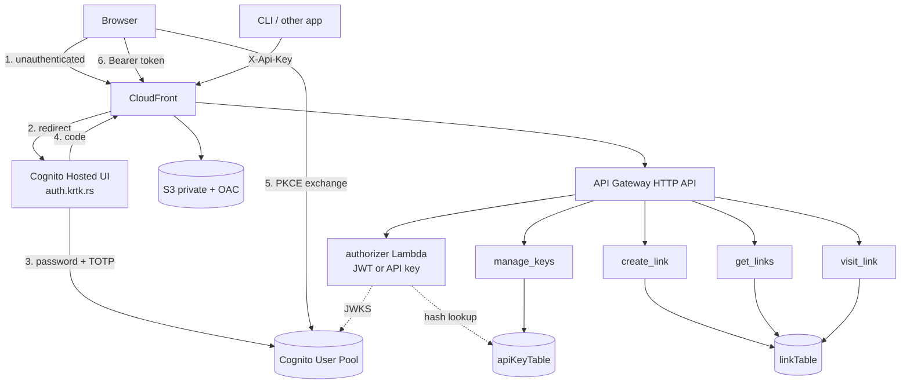

# Design: Cognito Authentication for krtk.rs

Implements the requirements in `requirements.md`. Built on `main` at `9ae11fd`, after the `modernize-and-harden` prerequisite (PR #9).

## 1. Architecture



`visit_link` is the only handler with no authorizer — redirects stay public (FR-2.3, FR-6.1).

## 2. Key design decisions

### 2.1 Dual credentials: a REQUEST Lambda authorizer for links, the native pool authorizer for keys

FR-4.3 requires `/api/links` to accept a Cognito JWT **or** an API key. A `HttpUserPoolAuthorizer` rejects anything without a valid JWT, so it cannot serve that route alone (FR-2.4).

**Two different authorizers, chosen per route:**

| Route | Authorizer | Why |
|---|---|---|
| `POST`/`GET /api/links` | custom `HttpLambdaAuthorizer` (REQUEST) | must accept either credential |
| `ANY /api/keys*` | native `HttpUserPoolAuthorizer` | FR-4.4 — an API key must not reach key management |
| `GET /{linkId}` | none | public |

Using the **native** pool authorizer on `/api/keys` is what enforces FR-4.4, and it does so at the edge: an `X-Api-Key`-only request never reaches the handler, so there is no code path to get wrong. The alternative — one authorizer returning an `authMethod` flag that the handler checks — puts a security boundary inside application logic where a missing `if` silently grants key-minting to a leaked key. Rejected for that reason.

**Authorizer caching is disabled** (`resultsCacheTtl: 0`). FR-4.6 requires a revoked key to fail on its *next* request; any cache TTL is a window where a revoked key still works. The cost is one extra Lambda invocation per API call, which at this traffic level is negligible.

Rejected alternative: no gateway authorizer, verifying inside each handler. It avoids one hop but duplicates JWT verification across `create_link` and `get_links`, and leaves the routes publicly invocable with authentication as a handler-level convention. The authorizer is one place to audit.

### 2.2 Ownership key layout: repurpose `SortKey`, add no GSI

Current schema:

- Table PK: `LinkId` (string). No sort key.
- GSI `TimeStampIndex`: PK `SortKey`, SK `TimeStamp`, `ProjectionType.ALL`.
- Every item is written with `SortKey = "LINKS"` — a literal constant (`SORT_KEY_VALUE` in `shared/src/core.rs:17`).

So the GSI partition key is already a constant discriminator that exists solely to make one queryable partition. **Change that constant to a per-owner value** and the existing index becomes a per-owner index:

```
SortKey = "USER#<cognito-sub>"
```

`list_urls` then queries the same index with the same expression, binding `:pk` to the caller's owner key instead of `"LINKS"`. Pagination is unchanged — the `ExclusiveStartKey` already carries `SortKey`, `LinkId`, and `TimeStamp`.

Why this over adding an `OwnerIndex` GSI on `OwnerId`:

- **No new GSI.** A `ProjectionType.ALL` GSI duplicates the entire table's storage and consumes write capacity on every put. Reusing the existing one costs nothing.
- **It removes a hot partition.** Today every link in the system shares one GSI partition (`"LINKS"`). Per-owner partitioning spreads writes, which is strictly better even at low volume.
- **No change to `list_urls`' shape** — one bound value differs.

Consequences, accepted:

- **No global "all links" query.** Nothing in the requirements needs one. If an admin view is ever wanted it needs a scan or a new index; noted as a future cost.
- `OwnerId` is stored as its own attribute too, not only encoded in `SortKey`. `SortKey` drives the query; `OwnerId` is the authoritative ownership field, is what the migration sets, and is what a defensive check reads. Storing both costs one small attribute and avoids parsing a composite key to answer "who owns this".
- `LinkId` remains the table partition key, so global uniqueness is unchanged and the `attribute_not_exists(LinkId)` condition on create still guarantees it (FR-3.4).

`OwnerId` and `SortKey` both go on **`ShortUrlRow`** (persistence). Neither is added to `ShortUrl` (the wire struct), per FR-3.1a — the JSON response stays byte-identical.

**Naming debt this creates, and how it is contained.** After this change the attribute named `SortKey` is not a sort key (it is a GSI *partition* key), and the index named `TimeStampIndex` is really a per-owner-ordered-by-time index. Both names predate this work and both are already slightly wrong today; this makes them more wrong. Renaming is deliberately **not** done here: renaming the attribute means rewriting every item, and renaming a GSI means creating a second index, backfilling it, cutting over, and deleting the first — a migration far larger than the feature, on a table that now has deletion protection.

Instead the misleading names are contained by documentation at both points a reader meets them:

- The `SORT_KEY_VALUE` constant is replaced by a documented `owner_key(sub) -> String` helper, so no call site builds the value by hand and the comment lives where the value is produced.
- `ShortUrlRow`'s `SortKey` field carries a comment stating it holds `USER#<sub>` and is the GSI partition key, not a sort key.
- The CDK GSI declaration gains a comment that `TimeStampIndex` partitions per owner.

If the names are ever worth fixing, it is a standalone migration spec, not a rider on this one.

### 2.3 API keys: a separate table

The link table's partition key is literally named `LinkId`. Storing API-key items in it (`LinkId = "APIKEY#<hash>"`) would make that attribute name a lie and put two unrelated entities behind one deletion-protection and PITR policy.

**New `apiKeyTable`:**

| | |
|---|---|
| PK | `KeyHash` — SHA-256 hex of the presented key |
| GSI `OwnerIndex` | PK `OwnerId`, SK `CreatedAt`, projection `ALL` |
| Attributes | `OwnerId`, `Label`, `KeyPrefix`, `CreatedAt`, `LastUsedAt`, `ExpiresAt` (optional) |

Verification is a single `GetItem` on the hash — O(1), no scan (FR-4.9). Listing and the FR-4.7 count check are one `OwnerIndex` query.

**Durability settings, and one hazard worth stating.** The table gets `removalPolicy: RETAIN` and `deletionProtection: true`, matching `linkTable` — losing it would silently break every CLI and script holding a key, with no way to tell users why.

Point-in-time recovery is **deliberately left off**, which differs from `linkTable`. A restore of this table would **resurrect revoked keys**: revoke a leaked key today, restore from a snapshot taken yesterday, and the leaked credential is valid again — with no signal that it happened. For link data a restore is pure recovery; for a credential store a restore is a rollback of security decisions. The data here is also trivially reconstructible: a user mints a new key in seconds, whereas a shortened link cannot be re-derived. If PITR is ever enabled, restoring must be paired with re-revoking anything revoked since the snapshot, and that procedure has to be written down before the feature exists rather than improvised during an incident.

`ExpiresAt` additionally carries a DynamoDB TTL so expired rows self-clean, but as noted below, rejection never depends on TTL having fired.

**Key format:** `krtk_` + 43 chars of base64url-encoded 32 random bytes from a CSPRNG. The `krtk_` prefix makes keys identifiable in secret scanners and logs. `KeyPrefix` stores the first 12 characters (`krtk_3f9aQ2`) so the UI can distinguish keys in a list without holding the secret (FR-4.5).

**`LastUsedAt` is throttled.** Updating it on every request adds a write to every API call. Instead it is updated best-effort only when the stored value is more than an hour old, via a conditional update whose failure is ignored. "Last used" granularity of an hour is enough to identify a dormant key; a write per request is not worth it.

**Expiry** is enforced in the authorizer by comparing `ExpiresAt` against now, not by DynamoDB TTL. TTL deletion is asynchronous and can lag by days — an expired key must be rejected immediately (FR-4.8). TTL is *additionally* set on the attribute so expired rows eventually self-clean, but rejection never depends on it.

### 2.4 Callback path: an extensionless object behind an explicit behaviour

CloudFront's `/?*` behaviour routes to API Gateway, and `?` matches exactly one character — which is why `/index.html` needed its own higher-precedence behaviour during the OAC migration. `/auth/callback` would match `/?*` the same way and be handed to `visit_link` as a short link lookup (FR-6.3).

Following the precedent already in the stack for `/terms` and `/privacy` — extensionless S3 objects with a content-type override:

- S3 object key: `auth/callback` (no extension), deployed from `website/auth/callback`.
- New CloudFront behaviour `/auth/*` → S3 origin, with a `ResponseHeadersPolicy` forcing `content-type: text/html; charset=utf-8`, mirroring `TermsResponseHeaders`.
- Redirect URI registered with Cognito: `https://krtk.rs/auth/callback`.

The OAC REST endpoint cannot resolve index documents, so the object must be addressed exactly (the lesson from `/index.html`). Behaviour ordering must place `/auth/*` above `/?*`.

Sign-out redirects to `https://krtk.rs/`, which the FR-5.1 check then bounces to the Hosted UI.

### 2.5 Cognito lives in `KrtkRsStack`

The User Pool goes in the existing `KrtkRsStack` (us-west-2) rather than a new stack. The custom domain needs an `auth.krtk.rs` certificate from `CertificateStack` (us-east-1), and that cross-region wiring already exists (`crossRegionReferences: true`, cert ARN passed through props). A third stack would add another cross-stack reference for no isolation benefit, and cross-stack references are now `weak` in this project's feature flags.

`deletionProtection: true` on the pool — deleting it destroys every user identity and TOTP enrolment, and unlike the link table there is no PITR for a user pool.

## 3. Data model changes

### 3.1 `linkTable` — attributes added

| Attribute | Type | Notes |
|---|---|---|
| `OwnerId` | S | Cognito `sub`. Authoritative ownership. |
| `SortKey` | S | Value changes from `"LINKS"` to `"USER#<sub>"`. Existing attribute, new content. |

No key schema change, no new index, no `LinkId` change — therefore no short URL changes (NFR-3).

### 3.2 Rust struct changes (`shared/src/core.rs`)

```rust
// Persistence shape — DynamoDB attribute names.
#[derive(Debug, Deserialize)]
pub struct ShortUrlRow {
    #[serde(rename = "LinkId")]      link_id: String,
    #[serde(rename = "OriginalLink")] original_link: String,
    #[serde(rename = "Clicks")]       clicks: u32,
    // ... existing fields unchanged ...
    #[serde(rename = "OwnerId")]      owner_id: Option<String>,  // Option: pre-migration rows
}
```

`owner_id` is `Option<String>` so a row written before migration deserializes instead of being discarded. FR-7.6 defines an ownerless link as resolvable but never listed, and this is what makes that state representable rather than a parse failure. `ShortUrl` (wire) gains nothing.

### 3.3 Error type extension (`shared/src/error.rs`)

Two variants added to the existing `thiserror` enum, with the status mapping extended:

```rust
#[error("Authentication required")]
Unauthorized,          // -> 401
#[error("Not permitted")]
Forbidden,             // -> 403
```

Messages are deliberately opaque and name no internal service, consistent with the existing `Database` variant rendering as "Data store operation failed". `Forbidden` covers an API key reaching `/api/keys` and any owner mismatch; it never distinguishes "exists but not yours" from "does not exist" in a way that would let a caller probe for other users' link IDs.

## 4. Authorizer Lambda

New crate `lambda/authorizer`, workspace member, arm64, `provided.al2023` — same shape as the existing functions.

**Flow:**

1. Read `Authorization: Bearer <jwt>` — if present, verify as a JWT and return.
2. Otherwise read `X-Api-Key` — if present, verify as an API key and return.
3. Neither, or verification fails → deny.

**JWT verification** uses `jsonwebtoken` against the pool's JWKS
(`https://cognito-idp.<region>.amazonaws.com/<poolId>/.well-known/jwks.json`), checking:

- RS256 signature against the key matching the token's `kid`
- `iss` equals the pool issuer
- `token_use == "access"` — an ID token is **not** accepted as an API credential
- `client_id` equals the app client
- `exp` not passed

JWKS is fetched once per execution environment and cached in warm memory with a 1-hour refresh, with a re-fetch on unknown `kid` to survive key rotation. Cognito signing keys are stable, so this costs one HTTPS call per cold start.

**API key verification:** SHA-256 the presented value, `GetItem` on `KeyHash`, then check the row exists, `ExpiresAt` is absent or in the future, and (throttled) bump `LastUsedAt`.

**Response:** simple response with `isAuthorized` plus context `{ ownerId }`. Handlers read `ownerId` from the request context; they never parse a token themselves. `authMethod` is included for logging only — it carries no authorization meaning, since FR-4.4 is enforced by route/authorizer choice (§2.1).

**Two authorizer types means two context shapes — a real implementation trap.** Because `/api/links` and `/api/keys` use different authorizers, the owner identity arrives in a different place on each route:

| Route | Authorizer | Where the owner comes from |
|---|---|---|
| `/api/links` | custom Lambda | `requestContext.authorizer.lambda.ownerId` — a string this design puts there |
| `/api/keys` | native user pool | `requestContext.authorizer.jwt.claims.sub` — a claim Cognito puts there |

A single "get the current owner" helper must therefore handle both shapes rather than assuming one. Writing it against only the Lambda shape compiles fine and fails at runtime on every `/api/keys` call — and only there, so a test suite exercising links but not keys would pass. `shared` gains one `owner_from_request(&Request) -> Result<String, Error>` function that tries both and returns `Unauthorized` if neither is present; no handler reaches into the request context directly.

## 5. Handler changes

| Handler | Change |
|---|---|
| `create_link` | Read `ownerId` from authorizer context; write `OwnerId` + `SortKey = USER#<sub>`. Never read an owner from the request body (FR-3.2). |
| `get_links` | Bind the query's `:pk` to `USER#<sub>` instead of `"LINKS"`. Pagination unchanged. |
| `visit_link` | **No change.** No authorizer, no ownership check (FR-3.5). |
| `process_analytics` | **No change.** It updates `Clicks` by `LinkId` and is ownership-agnostic (FR-6.2). |
| `manage_keys` | New. `POST` mint, `GET` list, `DELETE /{keyId}` revoke. |

`shared/src/core.rs` gains an owner-scoped signature on the write and list paths; a missing owner is a type error rather than a silent global write.

## 6. Frontend (`website/`)

New/changed files:

- `index.html` — auth gate, signed-in header with email + sign-out, API key management section, plus the FR-9 dark mode work.
- `auth/callback` — extensionless callback page: exchanges the code, then redirects to `/`.
- `assets/auth.js` — PKCE helpers, token store, refresh, `fetch`/HTMX request decoration.
- `assets/main.js` — dark mode toggle (FR-9.4) and existing helpers.
- `assets/auth-config.js` — **generated at deploy time**.

**Config injection.** The frontend needs the pool ID, client ID, and auth domain, which are CDK tokens unknown until deploy. The existing `BucketDeployment` gains a `Source.data('assets/auth-config.js', ...)` entry so CDK resolves the tokens and writes the file alongside the static assets. No manual post-deploy edit, no hardcoded IDs in the repo.

**Token handling.** Access and ID tokens in `sessionStorage` (FR-5.8). The PKCE verifier is held in `sessionStorage` only between the redirect out and the exchange, then deleted (FR-5.2).

**HTMX integration.** The page's existing `hx-get`/`hx-post` calls need the bearer header, so a single `htmx:configRequest` listener adds it and awaits a refresh when the token is near expiry (FR-5.3, FR-5.4). This is the one place tokens meet HTMX; individual `hx-*` attributes are untouched.

**Theme independence.** Sign-out clears `sessionStorage` only. The theme key lives in `localStorage` and survives (FR-5.10). The callback page carries its own copy of the FR-9.2 boot script, since it is a separate document and would otherwise flash white mid-redirect.

## 7. Migration

New bin crate `tools/migrate_owners`, run manually with local credentials — not a deploy-time custom resource, because it must run *after* the admin user exists (FR-7.2) and CDK cannot order that.

```
paginated Scan (ProjectionExpression: LinkId, OwnerId)
  └─ for each item lacking OwnerId:
       UpdateItem
         SET OwnerId = :sub, SortKey = :ownerKey
         ConditionExpression: attribute_not_exists(OwnerId)
```

Idempotency is structural: the condition expression makes a second run a no-op regardless of what the first run did (FR-7.3, FR-7.7). No item is ever rewritten, so `Clicks`, `TimeStamp`, and scraped metadata cannot be touched. Reports inspected / updated / skipped counts (FR-7.5).

Takes `--table` and `--owner-sub`, plus `--dry-run` which performs the scan and reports what it *would* change.

## 8. Rollout order

The order is load-bearing — FR-7.2's "empty list" failure mode comes from getting it wrong.

1. Deploy `auth.krtk.rs` certificate (`CertificateStack`, us-east-1). DNS validation.
2. Deploy the User Pool, app client, and custom domain. **Verify the Hosted UI actually serves** — Cognito provisions its own distribution and this lags `cdk deploy` success (FR-8.6).
3. `admin-create-user` for Darko; complete the forced password change and TOTP enrolment. Capture the `sub`.
4. Run `migrate_owners --dry-run`, inspect, then run it for real.
5. Deploy the authorizer, handler changes, new routes, and frontend — the point at which enforcement begins.
6. Verify: login with TOTP, list shows the migrated links, mint a key, use it from the CLI, revoke it, confirm 401.

Steps 1–4 change no behaviour for existing users; every pre-existing short link keeps resolving throughout (FR-7.4).

**Amendment found while writing `tasks.md`: steps 4 and 5 are one window, not two.** The GSI partition key and the query reading it must flip together — before migration items carry `SortKey = "LINKS"` and the deployed code queries `"LINKS"`; after, they carry `USER#<sub>` and only the new code queries that. So whichever goes first, there is an interval where the **listing renders empty**: migrate first and the old code finds nothing; deploy first and the new code queries ahead of the data. No ordering avoids this, because it is a simultaneous data-and-code cutover.

It is bounded and acceptable, but must be done deliberately:

- **Redirects are unaffected throughout.** `visit_link` and `process_analytics` key on `LinkId`, the table partition key, which never changes. No short URL breaks (FR-7.4).
- Only listing is affected, and only between the migration and the enforcement deploy.
- The table is small and single-owner, so the migration finishes in seconds.
- Run migration and the enforcement deploy **back to back**; do not pause between them.

An empty list in that window is expected and is not data loss — the items are present and resolvable the whole time.

## 9. Testing

**Rust unit tests** (extending the 15 now passing): API key generation shape and prefix extraction; SHA-256 hashing determinism; expiry comparison including the absent-`ExpiresAt` case; owner-key construction via the `owner_key` helper; `ShortUrlRow` deserialization both with and without `OwnerId`; error-to-status mapping for the two new variants; and `owner_from_request` against **both** authorizer context shapes plus the absent case — the §4 trap, which is otherwise only caught by exercising `/api/keys` live.

**CDK assertions** (extending the 41 now passing): the pool has `MfaConfiguration: ON` with TOTP only and SMS absent; `AdminCreateUserConfig.AllowAdminCreateUserOnly` is true; the app client has no secret, permits only the code grant, and does not permit implicit; `/api/links` carries the Lambda authorizer while `/api/keys` carries the user pool authorizer — the FR-4.4 boundary asserted structurally; a `/auth/*` behaviour exists and precedes `/?*`; CORS lists the krtk.rs origin and not `*`.

**Manual**, because they cannot be asserted from a template: the TOTP enrolment flow, no-theme-flash on the callback page, and that sign-out genuinely forces re-authentication rather than silently resuming the Hosted UI session (acceptance criterion 6 — the failure mode looks exactly like working 2FA).

## 10. Cost

Verified against the published Amazon Cognito pricing page at time of writing. Rates are us-west-2 list prices and should be re-checked with the [AWS Pricing Calculator](https://calculator.aws/) before relying on them for a budget.

**Net effect at current usage: approximately zero.** Single-user, invite-only usage sits inside permanent free tiers on every new component.

| Component | Cost model | At this scale |
|---|---|---|
| Cognito user pool | Per monthly active user (MAU) | **$0** — 10,000 MAU/month free tier |
| ACM certificate for `auth.krtk.rs` | Public certs are free | $0 |
| Route53 alias record | Alias queries to AWS targets are free | $0 |
| Cognito custom domain | No separate charge listed | $0 |
| `apiKeyTable` + `OwnerIndex` GSI | On-demand (TableV2 default), per request + storage | Pennies; storage is kilobytes, PITR off |
| Authorizer Lambda | Per invocation + duration | Cents; arm64, low memory, short |
| `manage_keys` Lambda | Per invocation | Effectively $0 — invoked only when managing keys |
| 2 new log groups | Ingestion + storage, 1-week retention | Cents |
| Extra CloudFront behaviour | No per-behaviour charge | $0 |
| Extra API Gateway routes | Charged per request, not per route | $0 |

### 10.1 The Cognito free tier is permanent, not a trial

Cognito's free tier of 10,000 MAU/month for the Lite and Essentials tiers "does not automatically expire at the end of your 12-month AWS Free Tier term, and it is available to both existing and new AWS customers indefinitely". This is not the usual 12-month new-account free tier — it does not lapse. Above it, Essentials is $0.015/MAU.

An MAU is any user for whom an identity operation occurs in a calendar month — sign-in, sign-out, token refresh, password change, attribute update. One user performing all of those repeatedly is still one MAU, so the 1-hour access token and its refreshes do not multiply the count.

### 10.2 The pool must be Essentials, and that is free anyway

The **Essentials** tier is required by this design and is also the default for new pools. Checked against the tier comparison:

- **TOTP MFA is available on all three tiers**, including Lite — FR-1.3 does not force a paid tier.
- **Refresh token rotation is Essentials and above** — FR-1.8 requires it, so Lite is ruled out.
- Managed Login (the current Hosted UI) is Essentials and above; Lite gets only the older classic hosted UI.
- **Plus is not needed.** It adds threat protection, adaptive auth, and compromised-credential detection, and critically **has no free tier** — every MAU is billed at $0.020. Selecting Plus for a single-user side project would convert a $0 line item into a billed one for features this spec does not use.

So the tier this design needs costs nothing at this scale, but the tier *above* it would start billing from the first user. Worth knowing before clicking through a console default.

### 10.3 The API key decision avoided a real recurring charge

Choosing custom API keys over Cognito's OAuth2 `client_credentials` grant turns out to matter financially, not just architecturally. Cognito **machine-to-machine authorization is a paid add-on with no free tier** — billed per token request (the pricing page's worked example is 5,000 token requests at $0.002925 = $14.63/month).

Under the M2M design, every CLI invocation would need a token request, so a script run on a loop bills per call, forever. Under the chosen design, an API key is a hash lookup in a table you own: one DynamoDB `GetItem` per request, on-demand, effectively free at this volume, with no per-token charge at any volume.

### 10.4 The one thing that scales with traffic

Disabling authorizer caching (§2.1) means **two Lambda invocations per `/api/links` request** — the authorizer plus the handler — rather than one. That is a deliberate trade: caching would leave a window where a revoked key still works, violating FR-4.6.

At single-user volume this is invisible. It is worth remembering that it is a linear multiplier on the API path: if traffic ever grows enough for Lambda invocations to be a noticeable line item, the lever is a short cache TTL, accepting a revocation delay equal to that TTL. Public redirect traffic (`GET /{linkId}`) has **no** authorizer and is unaffected — the high-volume path stays single-invocation.

### 10.5 What Infracost will and will not tell us

The repo is covered by Infracost (no CI config exists in-tree — no `.github/` directory at all — so this is the Infracost Cloud source-control integration commenting on PRs server-side, as it did on PR #9). Infracost does support CDK: it detects `cdk.json`, runs `cdk synth` itself, and prices the resulting CloudFormation.

**It will not confirm or contradict §10, for two documented reasons.**

1. **Cognito is not a supported resource.** It appears in neither Infracost's AWS paid-resource list nor its free-resource list. The single largest new component in this change is invisible to it.
2. **Infracost ignores free tiers by design.** From its AWS docs: "Free trials and free tiers, which are usually **not** a significant part of cloud costs, are ignored. This is because Infracost can only see the Terraform projects it is run against but free tiers are account-wide." The entire §10 conclusion rests on free tiers, so Infracost is answering a deliberately different question: *what would this cost with no free tier*, not *what will Darko be billed*.

Additionally, everything else new here — DynamoDB on-demand, Lambda invocations, CloudFront requests, CloudWatch ingestion — is **usage-based**, so without a usage file Infracost reports "Monthly cost depends on usage" rather than a figure.

**Expected output for this PR: a near-zero diff, most line items usage-dependent, Cognito absent.** That is the correct result, not a failure.

**Its real value here is as a regression detector.** If the Infracost comment ever shows a non-trivial fixed monthly increase, something priced-and-always-on was added that this design does not call for — a NAT gateway, a load balancer, a provisioned-capacity table, a second CloudFront distribution. Reviewing the comment is therefore worth doing precisely *because* the expected answer is "no change": any deviation is signal.

Two optional improvements, neither required by this spec:

- **Commit `cdk.context.json`.** Infracost explicitly prefers it co-located with `cdk.json`, and it is AWS best practice. It is not currently committed. This app performs no context lookups (`HostedZone.fromHostedZoneAttributes` and `Certificate.fromCertificateArn` are static, not lookups), so the practical benefit is small — but it removes a class of synth ambiguity on Infracost's runners.
- **Add an `infracost-usage.yml`** with estimated monthly Lambda invocations, DynamoDB request counts, and CloudFront requests. This converts the usage-based line items from "depends on usage" into real numbers, which would make the PR comment meaningful for this project rather than mostly empty. It would also let the §10.4 authorizer-invocation concern be quantified rather than reasoned about.

### 10.6 Non-costs worth noting

- No VPC, NAT gateway, or load balancer is introduced — those are the usual sources of a surprise fixed monthly charge, and none appear here.
- No second CloudFront distribution is paid for; Cognito provisions one for the custom domain at no listed charge.
- PITR is off on `apiKeyTable` for the security reason in §2.3, which also happens to avoid its cost.
- Admin-created users trigger an invitation email. Cognito's built-in email sending is free but capped at a low daily volume; at invite-only scale this never binds. Growing beyond it would mean configuring SES, which is a separate (cheap) charge.

## 11. Risks

| Risk | Mitigation |
|---|---|
| Cognito custom domain provisioning lags the deploy; login 404s and looks broken | §8 step 2 is an explicitly verified gate, not an assumption |
| Sign-out clears local tokens but leaves the Cognito session, so re-login skips TOTP | Logout endpoint is called, and this is a named manual test |
| Authorizer cold start adds latency to the first API call | Accepted; arm64 Rust cold start is small and traffic is single-user |
| Migration run against the wrong `sub` assigns every link to a non-existent user | `--dry-run` first; the condition expression means a wrong run cannot be silently repaired by re-running, so the dry run is the real safeguard |
| Closing PR #8 loses the dark mode work | Transcribed into requirements FR-9 before closing, including the `.gitignore` regression not to carry over |
| Rotating Cognito signing keys break cached JWKS | Re-fetch on unknown `kid`, 1-hour refresh |
| A future PITR restore of `apiKeyTable` silently revives revoked keys | PITR left off on that table by design (§2.3); enabling it requires a written re-revocation procedure first |
